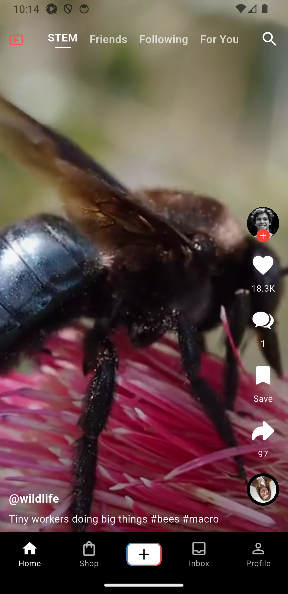
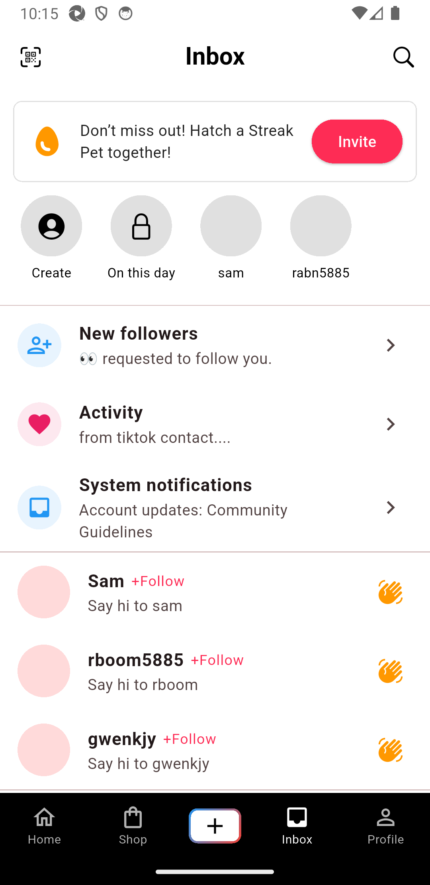
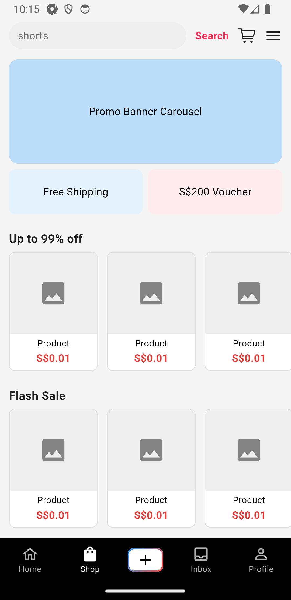

# 🎬 TikTok Flutter App (`hackathon_test_app`)

A lightweight **TikTok-style Flutter demo app**, built as the target application for the AutoGUI_TecJam2025automation framework.

<p align="center">
  
  
  
  
  
</p>

It provides a simple **short-video feed** with support for:

- Playing/pausing videos
- Likes, comments, and shares
- Profile view & editing
- Upload and image picking
- Navigation tabs (Home, Explore, Friends, Profile)

---

## 📦 Dependencies

Key packages from `pubspec.yaml`:

- `video_player` → video feed playback
- `visibility_detector` → auto-play/pause videos on scroll
- `share_plus` → native share sheet
- `image_picker` → upload/choose media
- `provider` → state management

---

## 🚀 Running Locally

### Prerequisites

- Flutter SDK (3.8+ recommended)
- Android Studio / Xcode (depending on target)
- Emulator or physical device

### Install Dependencies

```bash
flutter pub get

```

### Run on Emulator

```bash
flutter emulators --launch Pixel_3a_API_34
flutter run

```

The app will be installed on the emulator as:

```
appId: com.example.hackathon_test_app
activity: com.example.hackathon_test_app.MainActivity

```

---

## 🔗 Integration with Test Automation

This app is designed to be the **test target** for `test-automation/`.

1. **Build & Install the App** in your emulator:
    
    ```bash
    flutter run
    
    ```
    
2. **Update Appium Config** (`test-automation/config/settings.py`):
    
    ```python
    APP_PACKAGE  = "com.example.hackathon_test_app"
    APP_ACTIVITY = "com.example.hackathon_test_app.MainActivity"
    
    ```
    
3. Start Appium and run automation tests:
    
    ```bash
    appium --address 127.0.0.1 --port 4723
    cd test-automation
    python main.py
    
    ```
    

---

## 📂 Project Structure

```
lib/
├── app/        # App-level configuration (theme, routing, providers)
├── data/       # Data models and mock data
├── features/   # TikTok-style features (feed, comments, profile, upload)
├── shared/     # Shared widgets, constants, utils
└── main.dart   # App entrypoint

```

---

## 🧩 Development Notes

- This app is **not a production TikTok clone** — it’s a simplified demo to exercise automation scenarios (scroll, tap, input, share).
- All APIs are **local/mock** — no real TikTok backend is used.
- Extendable: you can add new screens or actions to test advanced automation flows.